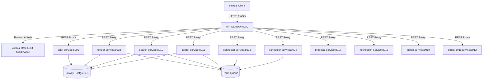
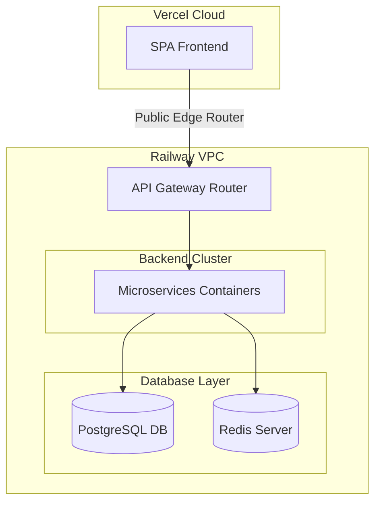
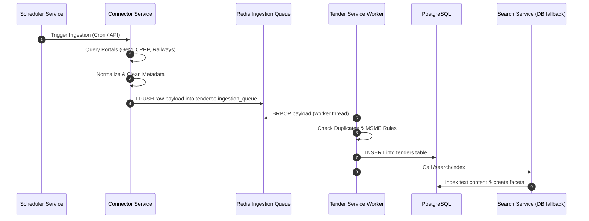
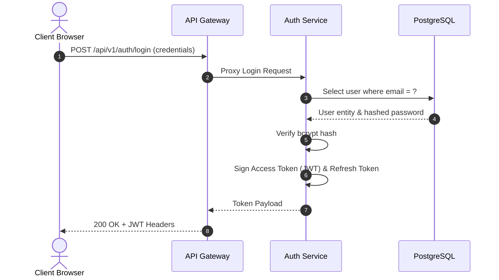
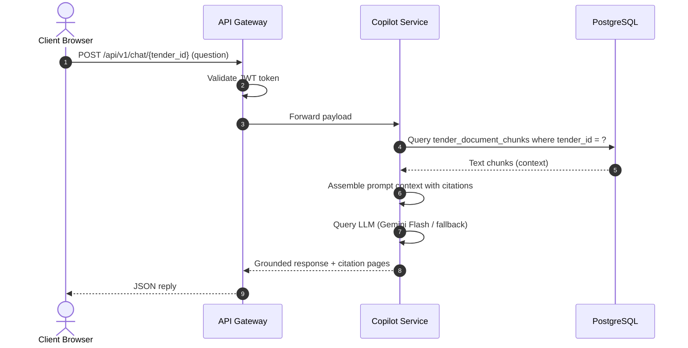
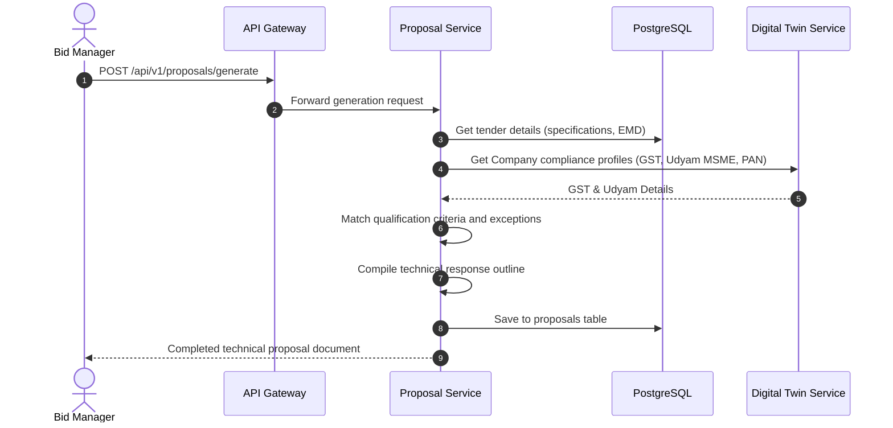
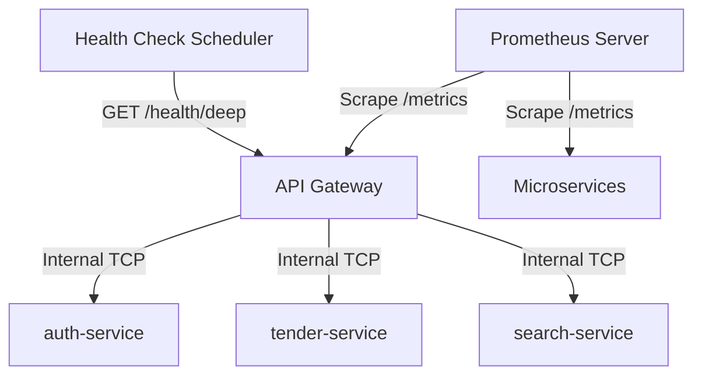

# System Architecture — TenderOS v1.0.0

This document describes the architectural patterns, service topologies, data flows, and runtime sequences of the TenderOS platform.

---

## 1. System Topology & Microservices Map

TenderOS uses a service-oriented event-driven architecture, decoupled via RESTful gateway proxies and an in-memory Redis message bus.

---

## 2. Deployment Diagram

Deployments are hosted across a dual cloud structure utilizing **Vercel** for the client-side single page application (SPA) and **Railway** for containerized API microservices and data nodes.

---

## 3. Data Flow Diagrams

### 3.1 Tender Ingestion Pipeline
How tenders are scraped, normalized, queued, and indexed:

---

## 4. Sequence Flows

### 4.1 Authentication & Registration Flow
How JWT session authorization is initiated and validated:

### 4.2 AI Copilot RAG Flow
How document-specific queries are parsed, grounded, and cited:

### 4.3 Proposal Generator Flow
How a bid response is generated:

---

## 5. Monitoring & Health Routing Flow

How Prometheus metrics and health checks are routed:

