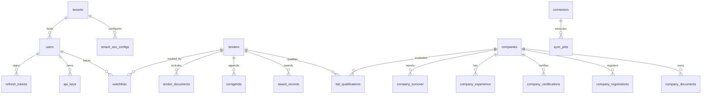

# Database Documentation — TenderOS v1.0.0

This document defines the relational schema, constraints, indexing strategies, and ER diagrams for the PostgreSQL database of TenderOS.

---

## 1. Entity Relationship (ER) Diagram

The ER diagram maps the primary schemas for tenants, users, tenders, documents, company profiles, and synchronization logs:



---

## 2. Table Specifications

### 2.1 tenants
Stores isolated organization spaces.
* **Fields**:
  - `id` UUID (Primary Key, DEFAULT gen_random_uuid())
  - `name` VARCHAR(255) (NOT NULL, UNIQUE)
  - `domain` VARCHAR(255) (UNIQUE)
  - `created_at` TIMESTAMP (DEFAULT NOW())

### 2.2 users
User records with authorization roles.
* **Fields**:
  - `id` UUID (Primary Key)
  - `tenant_id` UUID (Foreign Key references tenants(id))
  - `email` VARCHAR(255) (NOT NULL, UNIQUE)
  - `hashed_password` VARCHAR(255) (NOT NULL)
  - `role` VARCHAR(50) (NOT NULL, CHECK (role IN ('bid_manager', 'executive', 'admin')))
  - `is_active` BOOLEAN (DEFAULT TRUE)

### 2.3 tenders
Stores primary tender metadata aggregated from Indian government portals.
* **Fields**:
  - `id` UUID (Primary Key)
  - `tender_id` VARCHAR(100) (NOT NULL, UNIQUE)
  - `title` TEXT (NOT NULL)
  - `description` TEXT
  - `estimated_cost_lakhs` NUMERIC(15,2)
  - `emd_amount_lakhs` NUMERIC(15,2)
  - `emd_exempt_allowed` BOOLEAN (DEFAULT TRUE)
  - `msme_preference` BOOLEAN (DEFAULT TRUE)
  - `make_in_india_preference` BOOLEAN (DEFAULT TRUE)
  - `published_date` TIMESTAMP
  - `submission_deadline` TIMESTAMP
  - `ministry` VARCHAR(255)
  - `department` VARCHAR(255)
  - `state` VARCHAR(100)
  - `source` VARCHAR(100)
  - `categories` TEXT[] (Array of categories)
  - `status` VARCHAR(50) (DEFAULT 'active')

### 2.4 companies
Stores vendor data profiles (GST, PAN, Udyam MSME) for evaluation.
* **Fields**:
  - `id` UUID (Primary Key)
  - `name` VARCHAR(255) (NOT NULL)
  - `gstin` VARCHAR(15) (UNIQUE)
  - `pan` VARCHAR(10) (UNIQUE)
  - `udyam_registration_no` VARCHAR(50) (UNIQUE)
  - `is_msme` BOOLEAN (DEFAULT FALSE)
  - `is_startup` BOOLEAN (DEFAULT FALSE)
  - `local_supplier_class` VARCHAR(50) (CHECK (local_supplier_class IN ('Class-I', 'Class-II', 'Non-Local')))

---

## 3. Indexing & Optimization Strategy

To support fast full-text search fallbacks, category sorting, and relational joins, the following indexes are applied:

```sql
-- Trigram indexes for fast partial-string search on Ministry and Department
CREATE INDEX idx_tenders_ministry_trigm ON tenders USING gin (ministry gin_trgm_ops);
CREATE INDEX idx_tenders_dept_trigm ON tenders USING gin (department gin_trgm_ops);

-- GIN array index for Category searches
CREATE INDEX idx_tenders_categories ON tenders USING gin (categories);

-- Relational search optimizations (Foreign Key indexes)
CREATE INDEX idx_users_tenant_id ON users(tenant_id);
CREATE INDEX idx_tenders_published ON tenders(published_date DESC);
CREATE INDEX idx_tenders_deadline ON tenders(submission_deadline ASC);
```

---

## 4. Key Schema Constraints & Relationships

- **Referential Integrity**:
  - `ON DELETE CASCADE` is applied to `refresh_tokens(user_id)` and `watchlists(user_id)` to ensure user deletion cascades cleanly.
- **Uniqueness Check**:
  - `gstin` must be exactly 15 characters matching the Indian GST format.
  - `pan` must be exactly 10 characters matching the Income Tax department format.
- **EMD Exemption Rules**:
  - `emd_exempt_allowed` Defaults to `TRUE` to align with General Financial Rules (GFR) 2017 Rule 170.

---

## 5. DB Migration History Summary

1. **v1.0.0 Initialization**: Applied `infrastructure/postgres/init.sql` schema defining core microservice structures, creating tables, triggers, and indices.
2. **v1.0.1 Patch**: Added `company_documents` table to store vendor registration documents (GST certificate, Udyam printouts) and added `document_pipeline` columns to `tender_documents` for PDF processor status tracking.
