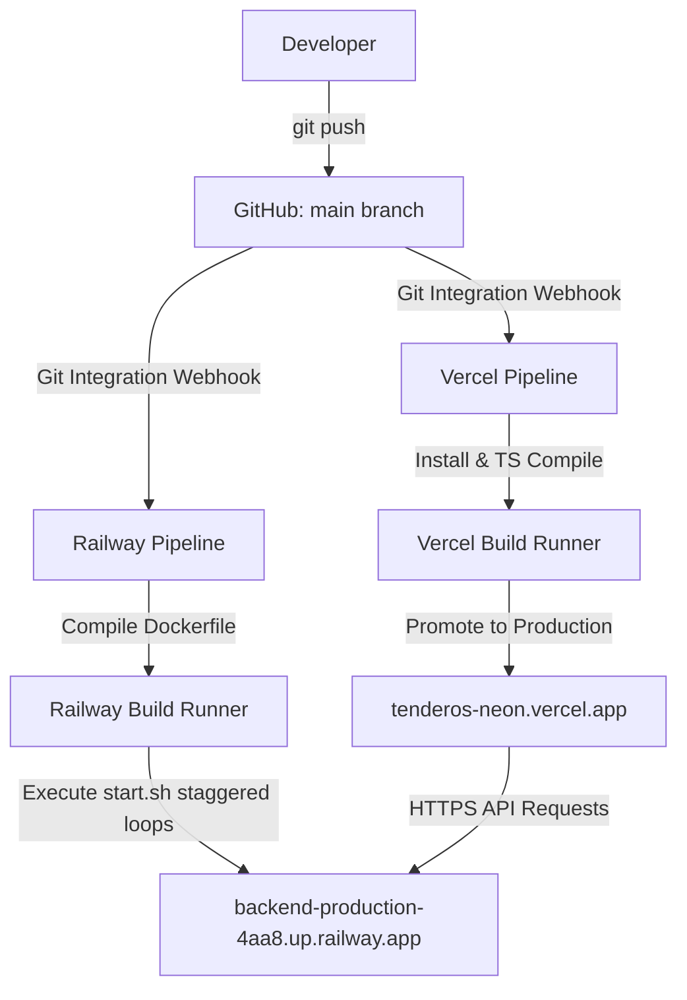

# Final CI/CD Pipeline Architecture — TenderOS v1.0.0

This report details the automated continuous integration and continuous deployment (CI/CD) pipelines of the TenderOS platform.

---

## 1. Automated Integration Architecture

---

## 2. Platform Integrations Configuration

- **GitHub Repository**: `keshav2101/tenderos`
- **Main Branch**: Builds are locked to the `main` branch to avoid deploying development code into production.

### 2.1 Vercel Configurations
- **Build Settings**:
  - Framework Preset: `Next.js`
  - Build Command: `vercel build` (translates to Next.js Turbopack compile)
  - Output Directory: `.vercel/output`
- **Environment Variables**:
  - `NEXT_PUBLIC_API_URL` set to `https://backend-production-4aa8.up.railway.app`.

### 2.2 Railway Configurations
- **Build Settings**:
  - Automatic Dockerfile compilation.
  - Watch target: Repository root directory.
- **Environment Variables**:
  - `DATABASE_URL` dynamically bound to reference the managed `Postgres` service database instance.
