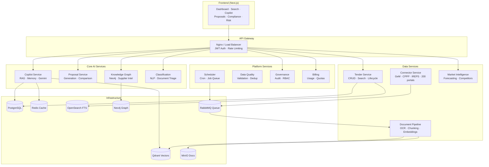

<div align="center">


# TenderOS v1.0

**India's First AI-Native Government Procurement Intelligence Platform**

[](https://github.com)
[](https://python.org)
[](https://fastapi.tiangolo.com)
[](https://nextjs.org)
[](https://postgresql.org)
[](LICENSE)
[](https://docker.com)
[](https://railway.app)
[](https://vercel.com)

[🚀 Quick Start](#quick-start) · [🏗️ Architecture](#architecture) · [📦 Services](#services) · [🤖 AI Features](#ai-features) · [📡 Connectors](#connectors) · [🔒 Security](#security) · [📊 Monitoring](#monitoring)

</div>

---

## Overview

TenderOS is a **production-grade, AI-native Procurement Decision Intelligence Platform** purpose-built for India's government procurement ecosystem. It turns the chaos of 200+ portals (GeM, CPPP, IREPS, State eProcurement, PSUs) into actionable intelligence — in real time.

### The Problem TenderOS Solves

Indian government procurement is fragmented across hundreds of portals, generating thousands of tenders daily. Businesses waste enormous time manually tracking, evaluating, and bidding on government contracts. 

**TenderOS eliminates this entirely.**

### What TenderOS Does

| Capability | Description |
|---|---|
| 🔍 **Unified Discovery** | Tracks 1,600+ live tenders from GeM, CPPP, IREPS, and 200 state portals |
| 🤖 **AI Copilot** | Conversational procurement advisor with RAG and memory |
| 📄 **Proposal Generation** | End-to-end bid drafting from compliance to commercial terms |
| 📊 **Risk Analysis** | Real-time bid risk scoring with mitigation strategies |
| ✅ **Compliance Engine** | MSME/Udyam, Startup India, Make in India, GFR 2017 checks |
| 🕸️ **Knowledge Graph** | Supplier intelligence network (Neo4j) |
| 🔎 **Semantic Search** | Vector + BM25 hybrid search across all tender documents |
| 📈 **Market Intelligence** | Competitor tracking, L1 prediction, win probability |

---

## Quick Start

### Prerequisites

- Docker Desktop 4.x+
- 16GB RAM (8GB minimum)
- macOS / Linux / Windows WSL2

### 1. Clone & Configure

```bash
git clone https://github.com/<your-org>/tenderos.git
cd tenderos
cp .env.production.template .env
# Edit .env — set GEMINI_API_KEY and your passwords
```

### 2. Start the Platform

```bash
docker compose up -d
```

This starts all 7 infrastructure services + 12 microservices + frontend. Wait ~90 seconds for full initialization.

### 3. Seed Initial Data

```bash
docker compose exec postgres psql -U tenderos -d tenderos -f /docker-entrypoint-initdb.d/init.sql
python scripts/seed_tenders.py
```

### 4. Open TenderOS

```
http://localhost:3000
```

---

## Architecture



---

## Services

| Service | Port | Technology | Description |
|---|---|---|---|
| **tender-service** | 8002 | FastAPI | Tender CRUD, lifecycle, GeM lifecycle tracking |
| **connector-service** | 8003 | FastAPI + Playwright | Portal scrapers for 200+ procurement portals |
| **scheduler-service** | 8004 | FastAPI + APScheduler | Cron-driven crawl orchestration |
| **document-pipeline** | 8005 | FastAPI + SentenceTransformers | OCR, chunking, vector indexing |
| **classification-service** | 8008 | FastAPI + spaCy | Tender classification, NLP enrichment |
| **knowledge-graph-service** | 8009 | FastAPI + Neo4j | Supplier network, relationship mapping |
| **copilot-service** | 8011 | FastAPI + Gemini | RAG-powered procurement advisor |
| **market-intelligence-service** | 8014 | FastAPI | Market trends, L1 prediction, win probability |
| **proposal-service** | 8017 | FastAPI + Gemini | Bid proposal generation and comparison |
| **billing-service** | 8020 | FastAPI | Usage tracking, quota management |
| **governance-service** | 8021 | FastAPI | Audit trails, RBAC, tenant isolation |
| **data-quality-service** | 8022 | FastAPI | Data validation, deduplication |
| **frontend** | 3000 | Next.js 14 | React dashboard, Copilot UI |

---

## AI Features

### 🤖 AI Copilot
- Conversational procurement advisor powered by **Gemini 2.0 Flash**
- **Retrieval-Augmented Generation (RAG)** with hybrid BM25 + dense vector search
- Conversation memory with session isolation per user
- Grounded responses with evidence citations

### 📄 Proposal Generation  
- Generates complete bid proposals: technical narrative, commercial terms, compliance statements
- Supports all standard Indian procurement formats (GeM, CPPP, NIT templates)
- EMD/PBG computation, MSME exemption handling, Startup India relaxations

### ✅ Compliance Engine
- Checks against GFR 2017 Rule 144(xi), Make in India Order 2017
- MSME/Udyam purchase preference (15%) verification
- Startup India prior experience and turnover exemption
- Class-I / Class-II Local Supplier classification

### 📊 Risk Analysis
- Multi-factor bid risk scoring (technical, financial, operational, compliance)
- L1 probability estimation from historical bid data
- Competitor intelligence and win rate analysis

---

## Connectors

TenderOS crawls **205 procurement portals** across India:

| Portal | Coverage | Update Frequency |
|---|---|---|
| **GeM (Government e-Marketplace)** | All categories | Every 4 hours |
| **CPPP (Central Public Procurement)** | Central govt tenders | Every 6 hours |
| **IREPS (Indian Railways)** | Railway procurement | Every 6 hours |
| **Defence (DRDO, HAL, BEL)** | Defence procurement | Daily |
| **PSUs (ONGC, BHEL, NTPC, IOCL)** | PSU contracts | Daily |
| **State Portals** (Maharashtra, Karnataka, UP) | State tenders | Daily |
| **Municipal Corporations** (AIIMS, IITs) | Institutional | Daily |

---

## Tech Stack

| Layer | Technology |
|---|---|
| **AI/ML** | Google Gemini 2.0 Flash, SentenceTransformers (all-MiniLM-L6-v2), spaCy |
| **Vector DB** | Qdrant v1.13.6 (hybrid BM25 + dense search) |
| **Graph DB** | Neo4j 5.x (supplier knowledge graph) |
| **Primary DB** | PostgreSQL 17 (1,600+ tenders, full ACID) |
| **Search** | OpenSearch 2.14 (full-text, multi-language) |
| **Cache** | Redis 7.x (sessions, rate limiting, result cache) |
| **Object Store** | MinIO (tender documents, OCR outputs) |
| **Queue** | RabbitMQ 3.13 (async crawl and processing jobs) |
| **API Framework** | FastAPI 0.139 + asyncpg (async PostgreSQL) |
| **Frontend** | Next.js 14, TypeScript, TailwindCSS |
| **Observability** | Prometheus + Grafana + OpenTelemetry + structlog |
| **CI/CD** | GitHub Actions → Railway (backend) + Vercel (frontend) |
| **Security** | JWT (HS256), RBAC, bcrypt, Gitleaks, Bandit, Trivy |

---

## Folder Structure

```
tenderos/
├── services/                    # 12 backend microservices
│   ├── tender-service/          # Port 8002 — tender lifecycle
│   ├── connector-service/       # Port 8003 — portal scrapers
│   ├── scheduler-service/       # Port 8004 — job orchestration
│   ├── document-pipeline/       # Port 8005 — OCR + embeddings
│   ├── classification-service/  # Port 8008 — NLP classification
│   ├── knowledge-graph-service/ # Port 8009 — Neo4j supplier graph
│   ├── copilot-service/         # Port 8011 — RAG + Gemini copilot
│   ├── market-intelligence-service/ # Port 8014 — forecasting
│   ├── proposal-service/        # Port 8017 — bid generation
│   ├── billing-service/         # Port 8020 — usage & quotas
│   ├── governance-service/      # Port 8021 — audit & RBAC
│   └── data-quality-service/    # Port 8022 — validation
├── apps/
│   └── frontend/                # Next.js 14 dashboard
├── scripts/                     # Verification, seeding, evaluation
├── infrastructure/              # Prometheus, Grafana configs
├── reports/                     # Generated verification reports
├── docs/
│   ├── operations/              # Admin, scheduler, DB docs
│   └── reports/                 # Historical audit reports
├── data/
│   └── samples/                 # Sample HTML portal pages
├── .github/
│   ├── workflows/               # GitHub Actions CI/CD
│   ├── ISSUE_TEMPLATE/          # Bug report, feature request
│   └── PULL_REQUEST_TEMPLATE.md
├── docker-compose.yml           # Full platform (all services)
├── docker-compose.infra.yml     # Infrastructure only
├── .env.production.template     # Environment variables template
├── ARCHITECTURE.md              # Detailed architecture docs
├── DEPLOYMENT.md                # Railway + Vercel deploy guide
├── API_DOCUMENTATION.md         # Full API reference
├── CHANGELOG.md                 # Version history
└── SECURITY.md                  # Security policy
```

---

## Installation

See [INSTALLATION.md](INSTALLATION.md) for detailed setup instructions.

### Environment Variables

Copy `.env.production.template` to `.env` and configure:

```bash
# Required
GEMINI_API_KEY=<your-gemini-api-key>

# Database (auto-generated secure passwords in template)
POSTGRES_PASSWORD=<secure-password>
REDIS_PASSWORD=<secure-password>
RABBITMQ_PASSWORD=<secure-password>

# Storage
MINIO_ACCESS_KEY=<key>
MINIO_SECRET_KEY=<secret>

# Optional — Qdrant auth
QDRANT_API_KEY=<key>
```

Full variable reference: `.env.production.template`

---

## Deployment

### Railway (Backend)

```bash
npm install -g @railway/cli
railway login
railway init
railway up
```

See [DEPLOYMENT.md](DEPLOYMENT.md) for full Railway setup guide including:
- Environment variable configuration
- Service networking
- Database provisioning
- Health monitoring

### Vercel (Frontend)

```bash
cd apps/frontend
vercel --prod
```

Set `NEXT_PUBLIC_API_URL` to your Railway backend URL.

---

## Security

TenderOS implements a defense-in-depth security model:

- **Authentication**: JWT HS256 tokens with configurable expiry
- **Authorization**: Role-based access control (Admin, Analyst, Viewer)
- **Secrets**: All credentials managed via environment variables, never hardcoded
- **Container Security**: Non-root containers, read-only filesystems where possible
- **API Security**: Rate limiting, input validation, CORS configuration
- **Dependency Scanning**: Automated via GitHub Dependabot + Trivy
- **SAST**: Bandit (Python) + Semgrep in CI pipeline
- **Secrets Detection**: Gitleaks in pre-commit hooks and CI

To report a security vulnerability: See [SECURITY.md](SECURITY.md)

---

## Monitoring

TenderOS ships with a complete observability stack:

| Tool | Purpose | Port |
|---|---|---|
| **Prometheus** | Metrics collection | 9090 |
| **Grafana** | Dashboards & visualization | 3001 |
| **Alertmanager** | Alert routing | 9093 |
| **OpenTelemetry** | Distributed tracing | - |
| **structlog** | Structured JSON logging | - |

All services expose `/metrics` (Prometheus format) and `/health` endpoints.

---

## Testing

```bash
# Unit tests
pytest tests/ -v --tb=short

# Integration tests (requires running Docker stack)
python scripts/verify_infrastructure.py

# API validation
python scripts/verify_production_readiness.py

# Playwright E2E (requires frontend running)
cd apps/frontend && npx playwright test

# Security scan
bandit -r services/ -ll
```

---

## CI/CD Pipeline

```
Git Push → GitHub Actions
    │
    ├─ Lint (ruff + black + isort)
    ├─ Unit Tests (pytest)
    ├─ Security Scan (Bandit + Trivy + Gitleaks)
    ├─ Docker Build (ghcr.io images)
    ├─ Deploy → Railway (backend)
    ├─ Deploy → Vercel (frontend)
    └─ Smoke Tests (Playwright)
```

Pipeline configuration: [.github/workflows/ci-cd-production.yml](.github/workflows/ci-cd-production.yml)

---

## Indian Procurement Terminology

TenderOS natively handles the full Indian government procurement ontology:

| Term | Description |
|---|---|
| **EMD** | Earnest Money Deposit — bid security |
| **BOQ** | Bill of Quantities — itemized tender requirements |
| **NIT** | Notice Inviting Tender — public tender announcement |
| **LOA** | Letter of Acceptance — formal bid award |
| **PBG** | Performance Bank Guarantee — execution security |
| **L1** | Lowest Bidder — standard evaluation criterion |
| **QCBS** | Quality and Cost Based Selection |
| **MSME/Udyam** | Small business registration with 15% purchase preference |
| **Startup India** | DPIIT-recognized startups with experience exemption |
| **Make in India** | Class-I/II local supplier preference (GFR 2017 Rule 144xi) |
| **GeM** | Government e-Marketplace — central procurement portal |
| **CPPP** | Central Public Procurement Portal |

---

## Roadmap

TenderOS v1.0 is **feature-complete**. The roadmap focuses on:

- **v1.1**: Natural language tender query ("Show me ONGC tenders above ₹5Cr with EMD waiver")
- **v1.2**: Automated bid submission pipeline (GeM direct submit)
- **v1.3**: Multi-language support (Hindi, Marathi, Tamil)
- **v2.0**: Multi-organization SaaS with tenant isolation

---

## Contributing

See [CONTRIBUTING.md](CONTRIBUTING.md) for the development guide and contribution standards.

## License

MIT License — see [LICENSE](LICENSE) for details.

## Contact

- **Project**: TenderOS — AI Procurement Intelligence Platform
- **Issues**: [GitHub Issues](https://github.com/<your-org>/tenderos/issues)
- **Discussions**: [GitHub Discussions](https://github.com/<your-org>/tenderos/discussions)

---

<div align="center">

**Built for India's ₹55 lakh crore government procurement market.**

*TenderOS is not affiliated with GeM, CPPP, or any government portal. It is an independent intelligence layer.*

</div>
