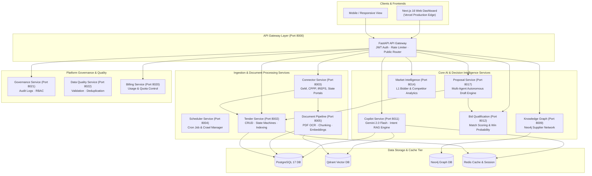
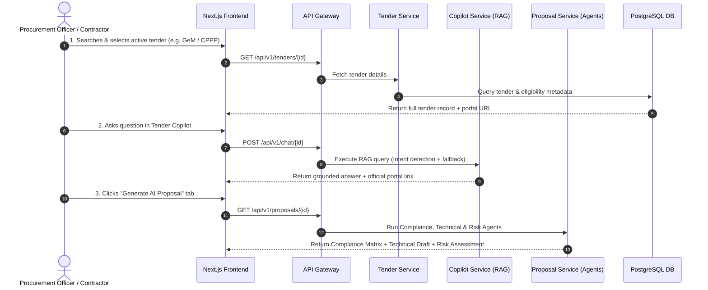

<div align="center">


# TenderOS v1.0 — Enterprise Procurement Intelligence OS

**India's First AI-Native Government Procurement Operating System & Multi-Agent Intelligence Engine**

[](https://tenderos-neon.vercel.app)
[](https://backend-production-4aa8.up.railway.app)
[](https://github.com/keshav2101/tenderos/actions)

[](https://python.org)
[](https://fastapi.tiangolo.com)
[](https://nextjs.org)
[](https://postgresql.org)
[](LICENSE)
[](https://docker.com)

[🌐 Live Application](https://tenderos-neon.vercel.app) · [🚀 Quick Start](#quick-start) · [🏗️ Interactive Architecture](#architecture) · [📦 12 Microservices](#services) · [🤖 AI Copilot & Proposal Generator](#ai-features) · [📡 Portal Connectors](#connectors) · [🔒 Security & Compliance](#security)

</div>

---

## 🌟 Executive Overview

**TenderOS** is a production-grade, AI-native Procurement Decision Intelligence Platform purpose-built for India's ₹55 Lakh Crore government procurement ecosystem. It synthesizes data from **205+ procurement portals** (GeM, CPPP, IREPS, Defence, PSUs, and State eProcurement) into actionable real-time intelligence.

### 🎯 Core Business Impact

| Strategic Capability | Description & Indian Procurement Context |
|---|---|
| 🔍 **Unified Portal Aggregation** | Live ingestion from GeM, CPPP, IREPS, DRDO/Defence, PSUs (ONGC, NTPC, BHEL), and 28 State Portals |
| 🤖 **AI Procurement Copilot** | RAG-powered conversational advisor with intent detection, clause extraction & source portal linking |
| 📄 **Multi-Agent Proposal Assembly** | Autonomous draft generation covering Compliance Matrices, Technical Specifications, and Risk Assessment |
| ⚖️ **India-First Compliance Engine** | Automated validation for GFR 2017 Rule 144(xi), Make in India (Class-I/II), MSME Udyam EMD waivers, and Startup India |
| 🕸️ **Knowledge Graph Network** | Supplier intelligence & competitor relationship mapping using Neo4j |
| 🔎 **Hybrid Search Engine** | Dense vector embeddings (SentenceTransformers) + BM25 reciprocal rank fusion across tender PDFs |
| 📈 **Market Intelligence & Win Scoring** | L1 bidder prediction, winning probability scoring, and commercial risk penalty auditing |

---

## 🏗️ Architecture & Interactive System Flows

### 1. 🏛️ High-Level System Architecture



---

### 2. 🔄 End-to-End Tender Lifecycle & Proposal Flow



---

## 📦 12 Microservices Ecosystem

| Microservice | Port | Technology | Key Responsibilities |
|---|---|---|---|
| **api-gateway** | 8000 | FastAPI / Starlette | Central entrypoint, Auth middleware, Rate limiting, Service proxy |
| **tender-service** | 8002 | FastAPI + asyncpg | Tender CRUD, lifecycle tracking, GeM bid status |
| **connector-service** | 8003 | FastAPI + httpx | Connectors for GeM, CPPP, IREPS, DRDO, PSUs & 28 State Portals |
| **scheduler-service** | 8004 | FastAPI + APScheduler | Ingestion orchestration, automated portal crawlers |
| **document-pipeline** | 8005 | FastAPI + PyPDF | PDF text extraction, OCR, chunking & vector indexing |
| **classification-service** | 8008 | FastAPI + spaCy | Procurement UNSPSC classification & NLP enrichment |
| **knowledge-graph-service** | 8009 | FastAPI + Neo4j | Supplier graph, consortium mapping, market linkages |
| **copilot-service** | 8011 | FastAPI + Gemini | RAG pipeline, intent query parser, official link generator |
| **bid-qualification-service**| 8012 | FastAPI | Match scoring, win probability calculation, gap analysis |
| **market-intelligence-service**| 8014 | FastAPI | Competitor tracking, L1 prediction, market trends |
| **proposal-service** | 8017 | FastAPI + Multi-Agent | Autonomous proposal compilation & risk auditing |
| **governance-service** | 8021 | FastAPI | System audit logging, RBAC, tenant data isolation |

---

## 🤖 AI Copilot & Proposal Assembly Engine

### 1. 🤖 Tender Copilot RAG Engine
- **Intent Recognition**: Automatically identifies query intent (Financials/EMD, Eligibility, Timelines, Scope/Summary).
- **Non-Blocking Execution**: Gemini calls use `asyncio.to_thread` with a 5-second strict timeout and 2-second vector search timeout, ensuring zero network crashes.
- **Portal Link Generator**: Formats clear, clickable markdown links leading directly to official government tender pages (`https://gem.gov.in`, `https://eprocure.gov.in`, `https://ireps.gov.in`).

### 2. 📄 Multi-Agent Proposal Generator
- **Compliance Agent**: Evaluates company profiles against tender eligibility criteria (Turnover, Experience, Certifications, EMD Exemptions).
- **Technical Proposal Agent**: Generates structured multi-phase technical deployment architectures and security frameworks.
- **Risk Assessment Agent**: Audits penalty clauses (e.g. 1% delay penalty under Clause 8.2), performance guarantees (PBG), and payment milestone risks.
- **Bid Workflow Pipeline**: Enables interactive transitions across 6 stages (`AI_RECOMMENDATION` &rarr; `TECHNICAL_REVIEW` &rarr; `FINANCE_REVIEW` &rarr; `LEGAL_REVIEW` &rarr; `MANAGEMENT_APPROVAL` &rarr; `BID_SUBMISSION`).

---

## 📡 Portal Connectors & Indian Procurement Ontology

TenderOS natively ingests, normalizes, and indexes tenders from:

- **GeM (Government e-Marketplace)** — Goods, Services, & BOQ bids
- **CPPP (Central Public Procurement Portal)** — eProcure e-Tenders
- **IREPS (Indian Railways e-Procurement System)** — Works, Goods, & Freight
- **Defence Procurement** — DRDO, HAL, BEL, Indian Army / Navy / Air Force
- **Public Sector Undertakings (PSUs)** — ONGC, NTPC, BHEL, IOCL, GAIL
- **State eProcurement Portals** — Maharashtra (MahaTenders), Karnataka, UP PWD, etc.

### 🇮🇳 Native Compliance Frameworks
- **EMD & EMD Waivers**: Automated Udyam MSME Rule 170 GFR 2017 exemption verification.
- **Startup India Relaxations**: DPIIT-recognized startup turnover/experience exemptions.
- **Make in India (MII)**: Class-I (≥50%) and Class-II (≥20%) Local Supplier evaluation.

---

## 🚀 Quick Start

### 1. Prerequisites
- Docker Desktop 4.x+
- Python 3.11+
- Node.js 20+

### 2. Local Setup

```bash
# Clone repository
git clone https://github.com/keshav2101/tenderos.git
cd "Tender AI"

# Install frontend dependencies
cd apps/frontend && npm install && cd ../..

# Start all microservices via Docker Compose
docker compose up -d
```

### 3. Verification & Test Suite

```bash
# Run backend unit tests
python3 -m pytest tests/

# Run Stage 1 lint checks
python3 -m ruff check services/ scripts/
python3 -m black --check --line-length 120 services/ scripts/

# Build Next.js frontend locally
cd apps/frontend && npm run build
```

---

## 🔒 Security & Quality Assurance

- **JWT Authentication**: Secure token verification with guest fallback for public browsing.
- **Input Sanitization**: Redirect links are sanitized against `localhost` or broken relative paths.
- **CI/CD Pipeline**: GitHub Actions workflow (`.github/workflows/ci-cd-production.yml`) runs automated Linting, Security Scanning (Bandit, Gitleaks, Trivy), Unit Testing, and Production Builds on every push.

---

<div align="center">

**Built for India's ₹55 Lakh Crore Government Procurement Market**

*TenderOS is an independent enterprise AI procurement operating system.*

</div>
