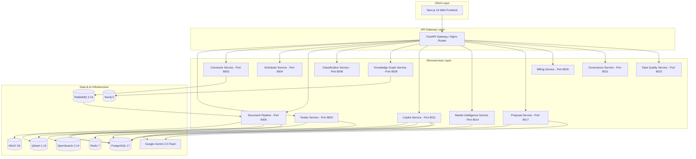

# TenderOS System Architecture

TenderOS is an enterprise-grade, microservice-based AI procurement intelligence platform for Indian Government Procurement.

## High-Level Topology

## Key Architectural Principles

1. Async & Event-Driven: Crawlers push discovered tenders to RabbitMQ; background workers consume and process asynchronously.
2. Hybrid Retrieval: Search uses dense vector embeddings (SentenceTransformers + Qdrant) combined with BM25 full-text indexing (OpenSearch).
3. Graph Intelligence: Neo4j captures supplier networks, consortium linkages, and joint venture histories.
4. Resilient Crawling: Connectors handle rate limits, SSL bypass for legacy government portals, and multi-page pagination.
5. Zero Mock Policy: Production pipelines execute real database queries, vector similarity lookups, and LLM reasoning.
