# Walkthrough — Phase 11: Production Infrastructure & GA Certification

## Final Release Decision: ❌ NO GO — General Availability Deferred (Hosted Backend Missing)

---

## 1. Deployment Dependency Graph (Phase A)

The following diagram maps the startup order and runtime dependencies for the TenderOS microservices ecosystem:

```mermaid
graph TD
    %% Frontend
    FE[frontend] --> GW[api-gateway]

    %% Gateway & Core services
    GW --> PG[(PostgreSQL)]
    GW --> RD[(Redis)]

    %% Auth & Tenant services
    AUTH[auth-service] --> PG
    AUTH --> RD
    TNDR[tender-service] --> PG
    TNDR --> RD
    DT[digital-twin-service] --> PG
    BILL[billing-service] --> PG
    BID[bid-qualification-service] --> PG

    %% Search & Vector store services
    SRCH[search-service] --> OS[(OpenSearch)]
    SRCH --> QD[(Qdrant)]
    COP[copilot-service] --> QD

    %% Message queues & async processing
    CONN[connector-service] --> RMQ[(RabbitMQ)]
    CONN --> RD
    SCHED[scheduler-service] --> RMQ
    SCHED --> RD
    DOC[document-pipeline] --> RMQ
    DOC --> MIN[(MinIO / GCS)]
    OCR[ocr-service] --> MIN
    EXT[ai-extraction] --> RD
    KG[knowledge-graph-service] --> N4J[(Neo4j)]

    %% Styling
    classDef infra fill:#2d3748,stroke:#4a5568,stroke-width:2px,color:#fff;
    classDef app fill:#3182ce,stroke:#2b6cb0,stroke-width:2px,color:#fff;
    class PG,RD,RMQ,MIN,OS,QD,N4J infra;
    class FE,GW,AUTH,TNDR,DT,BILL,BID,SRCH,COP,CONN,SCHED,DOC,OCR,EXT,KG app;
```



---

## 2. Accomplished Validation Actions

We have evaluated the General Availability (GA) readiness of TenderOS v1.0.0. While the local production stack is fully operational, the hosted cloud backend target does not exist.

Key findings:
- **Hosted Backend Blocked**: GCP project `tender-ai-501123` lacks Kubernetes Engine API activation. No active GKE cluster or cloud DB/caching layers are provisioned.
- **Local Stack Complete**: The system is fully verified against the local production Docker Compose profile (`docker-compose.local.yml`).
- **Defect Resolution (DEF-001)**: The session refresh failure after Redis restarts was successfully resolved by implementing active connection pings in `_get_redis()`. All 8 local auth lifecycle steps PASS.
- **Local Resiliency & Recovery**: Confirmed local pg_dump backup integrity (1,031 tenders) and Redis recovery RTO of 7.1s.

---

## 3. Fixed Defects & Code Changes

### [MODIFY] [auth_service.py](file:///Users/keshavgupta/antigravity/Tender%20AI/services/auth-service/app/auth_service.py)
Implemented active connection validation inside the Redis client provider function:
```python
    async def _get_redis(self) -> aioredis.Redis:
        """Return a live Redis connection, reconnecting if the cached client is stale."""
        if self._redis is not None:
            try:
                await self._redis.ping()
                return self._redis
            except Exception:
                # Cached client is broken (e.g. Redis restarted) — reconnect
                try:
                    await self._redis.aclose()
                except Exception:
                    pass
                self._redis = None
        self._redis = await aioredis.from_url(settings.redis_url, decode_responses=True)
        return self._redis
```

---

## 4. Phase 11 Validation Reports Index

The following reports document the evidence gathered during Phase 11 validation:

1. 📂 **[Master GA Decision Report](file:///Users/keshavgupta/.gemini/antigravity-ide/brain/5179e53b-a517-42c0-b97c-9f019caff6c1/phase11_ga_decision.md)**: Details the critical cloud deployment blockers, deferred checks, and the resolution roadmap to achieve GO.
2. 📂 **[Environment Validation](file:///Users/keshavgupta/.gemini/antigravity-ide/brain/5179e53b-a517-42c0-b97c-9f019caff6c1/production_environment_validation.md)**: Confirms the local Docker Compose start, network settings, and Vercel DNS/TLS routing.
3. 📂 **[API Validation](file:///Users/keshavgupta/.gemini/antigravity-ide/brain/5179e53b-a517-42c0-b97c-9f019caff6c1/production_api_validation.md)**: Logs response structures, codes, and transaction latencies.
4. 📂 **[Authentication Validation](file:///Users/keshavgupta/.gemini/antigravity-ide/brain/5179e53b-a517-42c0-b97c-9f019caff6c1/production_authentication_validation.md)**: Verifies JWT signature validation, token revocation lists, and the RBAC authorization matrix.
5. 📂 **[Connector Validation](file:///Users/keshavgupta/.gemini/antigravity-ide/brain/5179e53b-a517-42c0-b97c-9f019caff6c1/production_connector_validation.md)**: Validates scraper execution, duplicate prevention, and fallback mechanisms.
6. 📂 **[Performance Latencies](file:///Users/keshavgupta/.gemini/antigravity-ide/brain/5179e53b-a517-42c0-b97c-9f019caff6c1/production_performance_validation.md)**: Logs local latency benchmarks against backend SLAs.
7. 📂 **[Security Policy & Headers](file:///Users/keshavgupta/.gemini/antigravity-ide/brain/5179e53b-a517-42c0-b97c-9f019caff6c1/production_security_validation.md)**: Audits HTTP headers (HSTS, X-Frame-Options), cookie attributes, and NPM audits.
8. 📂 **[Disaster Recovery](file:///Users/keshavgupta/.gemini/antigravity-ide/brain/5179e53b-a517-42c0-b97c-9f019caff6c1/production_dr_validation.md)**: Validates db dumps, restores, and container auto-reconnect pools.
9. 📂 **[Smoke Test Scenarios](file:///Users/keshavgupta/.gemini/antigravity-ide/brain/5179e53b-a517-42c0-b97c-9f019caff6c1/production_smoke_test.md)**: Records functional sign-offs for all smoke test steps.
